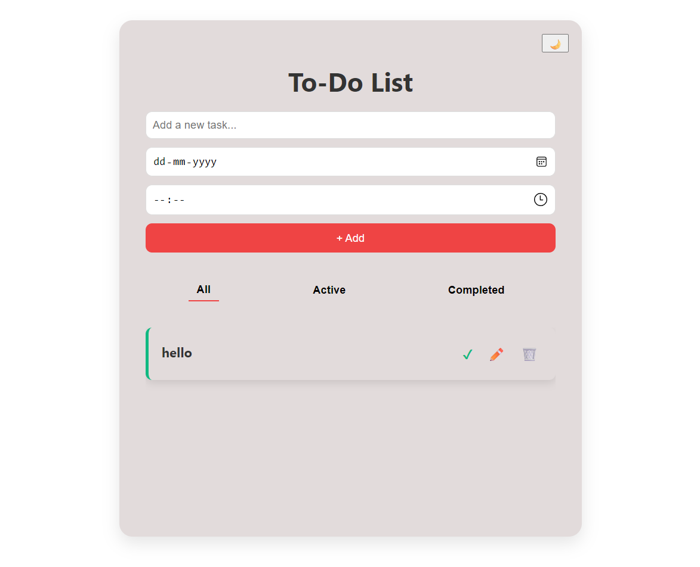

# 📝 To-Do List Web App

A responsive and user-friendly **To-Do List** application built using **HTML**, **CSS**, and **JavaScript**.  
This app allows users to add tasks with a due date and time, mark them as completed, edit, delete, and filter them — all using **Local Storage** for saving data persistently in the browser.

---

## 🚀 Features

- ➕ **Add New Tasks with Date & Time**
- 📝 **Edit Tasks Anytime**
- ✅ **Mark Tasks as Completed**
- ❌ **Delete Tasks**
- 🧹 **Filter Tasks**: All / Active / Completed
- 💾 **Local Storage Support** – Saves tasks even after refresh or browser close
- 🌙 **Dark Mode Toggle** (see top right icon)
- 📱 **Responsive Design** – Works across desktop, tablet, and mobile

---

## 📸 Screenshot

> UI Preview:

---

## 🛠️ Tech Stack

- **HTML5** – Page structure
- **CSS3** – Styling and layout
- **JavaScript (ES6)** – Interactivity and data handling
- **LocalStorage API** – Persistent data storage in the browser

---

